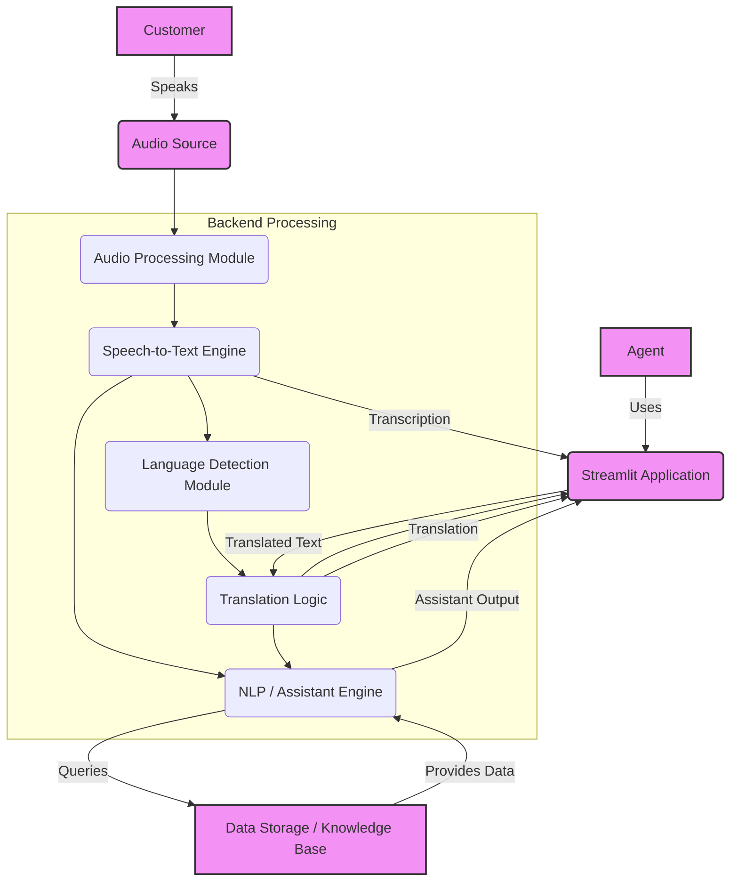

# CTRL_Z: Real-Time Assistant for Sales Agents

An AI-powered platform designed to improve sales conversion rates through real-time call analysis and feedback.

## Main App Features
- Live Conversation Audio Transcript using Google Speech-to-Text
- Real-time AI Agent Call Analysis using Gemini AI
- Document/URL Context Integration
- Pre-loaded Transcript Analysis
- Custom Analysis Prompts

### Primary Sectors
- Insurance
- Loans
- Investments
- Education Products/Courses

### Call Categories
1. New Leads (Cold Calls)
2. Warm Leads

### Cold Call Checklist
- [ ] Professional Greeting
- [ ] Clear Self Introduction
- [ ] Articulate Reason for Call
- [ ] Customer Problem Understanding
- [ ] Value Proposition
- [ ] Next Steps/Call to Action

## Problem Statement
Low conversion rates on cold calls due to:
- Inconsistent call quality
- Missed opportunities for engagement
- Lack of real-time feedback
- Variable agent performance

## Solution
AI-powered real-time analysis platform that:
- Provides instant feedback on call performance
- Identifies improvement areas
- Suggests better responses
- Tracks conversation quality metrics

## Technical Architecture

## Setup
1. Clone the repository
2. Create a `.streamlit/secrets.toml` file with your GEMINI_API_KEY
3. Install requirements: `pip install -r requirements.txt`
4. Run the app: `streamlit run app.py`

## Features in Development
- Multi-language support
- Call sentiment analysis
- Automated call scoring
- Performance analytics dashboard
- Team performance tracking
- Best practices library

## Contributing
Contributions are welcome! Please read our contributing guidelines and code of conduct.